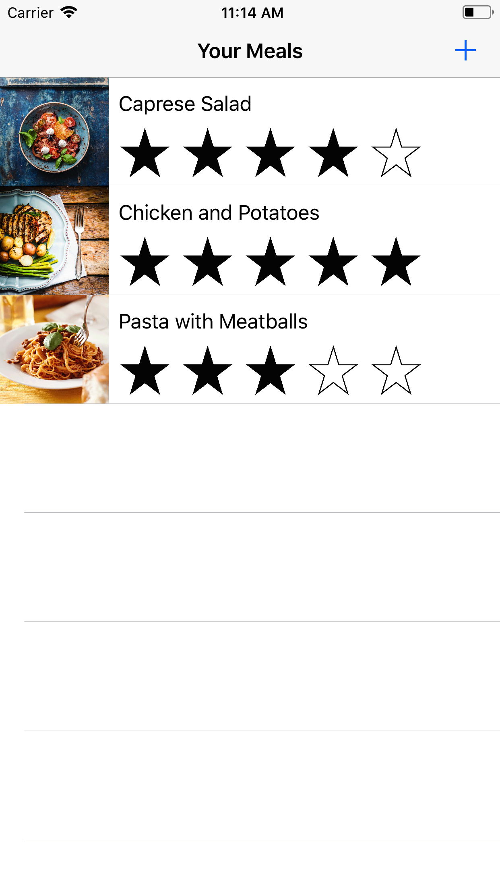

### Intro
I attempted to get an ios app up and running. I followed the tutorial [here](https://developer.apple.com/library/content/referencelibrary/GettingStarted/DevelopiOSAppsSwift/index.html#//apple_ref/doc/uid/TP40015214-CH2-SW1) and was able to make it through all of the "Building the UI" section and most of the "Working with Table Views" section, a screenshot of one of the screens is shown below.

{width=50px, height=100px}

### What I learned

* How to navigate & use Xcode.
* How to add buttons, images, and labels to ios apps
* How to use a storyboard to create a UI and then link it to functionality in code
* How to use ios simulator to view and test an app
* How to use the unit test templates built into Xcode to test my app and find bugs

### What didn't work
Most of the issues I had were related to either the way Xcode was setup or me doing something in the tutorial incorrectly. I was able to fix all of the Xcode issues by googling around and the tutorial included checkpoints so I could tell when I had done something wrong and go back to fix it. Once the tutorial got into the Table View portion, it started being a little more difficult to keep up with and I found myself struggling to understand some of the Swift syntax (this was my first time ever coding in Swift).
